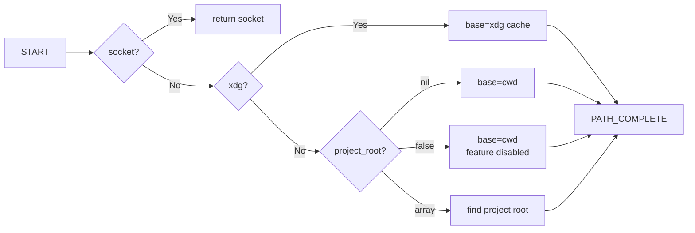
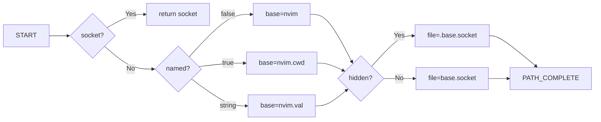

# nvim-auto-listen

> Automatically start a Neovim remote server on a `.nvim.socket` socket file.

## Usage

Install this plugin in your Neovim configuration. When Neovim starts, it will automatically start a remote server on a `.nvim.socket` socket file in the current working directory if one doesn't already exist.

### Example Usage

```bash
nvim
# Server automatically starts on .nvim socket

# From another terminal, connect to the session:
nvim --server .nvim.socket --remote-send ':echo "Hello from remote session"<CR>'
```

## Configuration

You can customize the plugin behavior:

```lua
require('auto-listen').setup({
  socket = 'nvim.sock',         -- Custom socket path (optional)
  socket_xdg_runtime = true,    -- Use XDG cache directory
  socket_named = true,           -- Use directory name in socket: .nvim.<dirname>.socket
  socket_hidden = false,          -- Create visible (non-hidden) socket file
  project_root = false,          -- Disable project root detection
  autorun = false,              -- Disable automatic server start
})
```

### Options

- `socket`: Full path to the socket file. If not provided, socket is auto-generated.
- `socket_xdg_runtime` (boolean, default: `false`): Use XDG cache directory (`vim.fn.stdpath("cache")`) instead of current working directory.
- `socket_named` (boolean|string, default: `false`): Include name in socket filename.
  - If `true`: use current directory name (e.g., `.nvim.myproject.socket`)
  - If string: use that literal name (e.g., `.nvim.custom.socket`)
  - Note: Always uses current working directory name, even with `socket_xdg_runtime = true`. This prevents socket conflicts between different projects.
- `socket_hidden` (boolean, default: `true`): Create hidden socket file (with leading dot).
- `project_root` (string[]|false|nil, default: `{"README.md", "package.json", "Cargo.toml", "pyproject.toml"}`): Array of filenames to search for when determining project root. When not using `socket_xdg_runtime`, the plugin recurses up from the current working directory until it finds a directory containing one of these files. Set to `false` to disable project root detection and use the current directory directly. Set to a custom array to override the default list. When `nil`, the default list is used.
- `autorun` (boolean, default: `true`): Automatically start server on Neovim startup.

## Socket Path Calculation

The socket file path is determined based on configuration options:

### Directory Path



### Filename



## License

MIT
